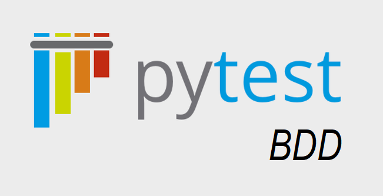

# pytest-bdd-practice
Repository with examples on pytest-bdd features<br>



This repo uses a Calculator analogy to understand the features for pytest-bdd.<br>

# Short-tro

pytest-bdd is a python package which enables automation to facilitate BDD using Gherkin syntax. <br>
It doesn't require any special runner and uses pytest as its runner. <br>

## What is BDD?

BDD (Behaviour Driven Development) frameworks provides a way to write test cases in a natural language style improving collaboration between developers, testers and stakeholders. <br>

Common Python packages supporting BDD, <br>

- behave
- radish
- pytest-bdd

## What is Gherkin?

Gherkin is a Domain Specific Language (DSL) used for writing structured, human readable test scenarios in Behaviour Driven Development (BDD).<br>

Common BDD frameworks utilising Gherkin, <br>

- Cucumber (for Java, JavaScript, Ruby, etc.)
- pytest-bdd (for Python)
- behave (for Python)
- SpecFlow (for .NET)
- Behat (for PHP)

## How to install the package?

pytest-bdd could be installed using pip <br>

```
pip install pytest-bdd
```

## What is a .feature file?

It is a plain text file used in BDD to define test scenarios using Gherkin syntax. <br>

Each feature file could hold only one feature. <br>

Line endings terminate statements <br>

Spaces/tabs are used for indendation (spaces are more portable)<br>

Comment lines are allowed anywhere in the file (starts with #). <br>

This file acts as documentation and determines the number of test methods. <br>

## What are the common elements?
The common elements used in the .feature file following Gherkin syntax include,

- feature - defines the functionality that is being tested.
- scenario - represents a test case
- given - defines the pre-requisite of the test case
- when - defines the action preformed (test step)
- then - defines the validation of test result

## What is a scenario decorator?
Scenario decorator binds the .feature file with a test method.

e.g.,

```
pytest examples/test_with_bdd.py -v
```

To get a glimpse of how the same test script would be without using pytest-bdd,

```
pytest examples/test_without_bdd.py -v
```

## What are step arguments?

Step arguments facilitate passing dynamic values to .feature file and reduces code duplication.

Step arguments used in pytest-bdd,

- string - default/null/exact parser
- parse - simple parser with readable syntax
  - uses str.format()
  - format - {variable_name: format_specifier}
  - {value_01: d} - for integer
  - {value_01: f} - for float
  - {value_01: s} - for string

e.g.,

```
pytest examples/test_reuse_steps.py -v
```

- re - for flexible matching
  - uses regular expressions
- cfparse - cardinality field support
  - uses str.format() with explicit types
  - useful for strict type enforcement

e.g.,

```
pytest examples/test_bdd_param.py -v
```

## How is parameterization handled?

Parameterization can be enabled using Scenario Outline and Examples. i.e when the entire scenario has to be executed multiple times with different data sets, Scenrio Outline is used.

e.g.,

```
pytest examples/test_bdd_param.py -v
```

## What are tags?

Tags label Scenario, Scenario Outline or Example tables for better organization.<br>
They allow selective test execution.<br>
Tags start with @<br>
Tags are similar to pytest markers, but could be used only inside the .feature file <br>

e.g.,

```
pytest examples/test_tags.py -v
```

To select cases matching a specific tag, -k or -m option of pytest can be used.

e.g.,

```
pytest examples/test_tags.py -k positive -v
```

```
pytest examples/test_tags.py -m negative -v
```

## What are rules?

Rules are used to group related scenarios.
It improves readability and makes maintenance easier.

e.g.,

```
pytest examples/test_rules.py -v
```

## What is a datatable?

Datatables provide a way to pass multiple rows of data to a single step (pass structured data).<br>
It is used inside Given, When or Then steps inside the .feature file.<br>

e.g.,

```
pytest examples/test_rules.py -v
```
Scenario Outline and Examples are used to feed multiple data sets to an entire scenario whereas Datatable feeds multiple rows of data to a single step of a scenario.<br>

## What is a target fixture?

Target fixtures are used to store the return values of steps so that they could be used in other steps.<br>
This helps avoid global states by passing values dynamically.<br>

e.g.,

```
pytest examples/test_rules.py -v
```

## Official Documentation

Link for the [official documentation](https://pytest-bdd.readthedocs.io/en/stable/#)

## Reach out

You have reached the end of this document.<br>
Thank you for your patience.<br>
If you have any questions, feedback, or suggestions, feel free to reach out.<br>

- 📧 Email: [kamali.koshy@hpe.com](mailto:kamali.koshy@hpe.com)  